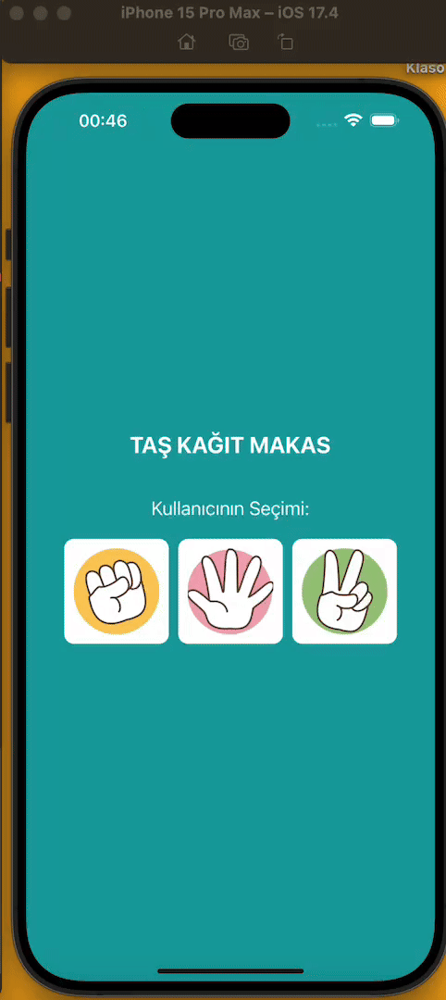

<h1> ReactNative_RockPaperScissors </h1>

This React Native project is a simple and fun implementation of the classic rock-paper-scissors game played between a user and the computer. The user selects an option (rock, paper, or scissors) via the screen, and the computer makes a random selection. The results are displayed on the screen to show whether the user wins or loses. The project utilizes React Native components and basic JavaScript algorithms.

<h2> Screenshot </h2>

